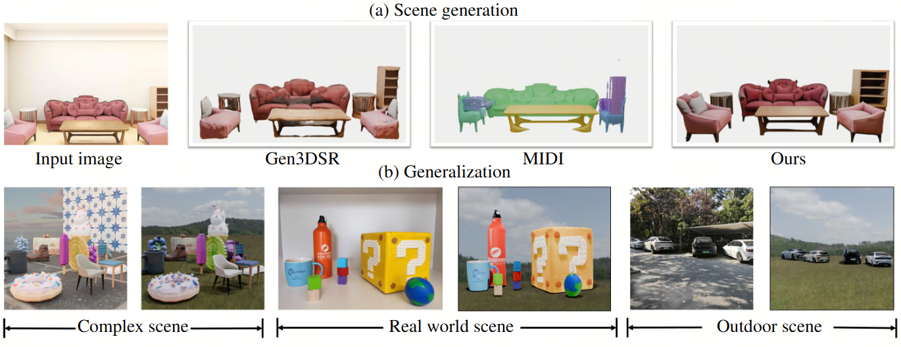

# [CVPR 2026] 3D-Fixer: Coarse-to-Fine In-place Completion for 3D Scenes from a Single Image

## [Project Page](https://zx-yin.github.io/3dfixer/) | [Paper]() | [Model]() | [Dataset]() | [Online Demo]()



3D-Fixer proposes a novel **In-Place Completion** paradigm to create high-fidelity 3D scene from a single image. Specifically, 3D-Fixer extends 3D object generative priors to generate complete 3D assets conditioning on the partially visible point cloud at the same location, which is cropped from the fragented geometry obtained from the geometry estimation methods. Unlike prior works that require explicit pose alignment, 3D-Fixer explicitly utilizes the fragmented geometry as the spatial anchor to preserve layout fidelity.

## Features

* **High Quality:** It generates high quality 3D assets for diverse scenes.
* **High Generalizability:** It generalizes to real world scenes and complex scenes.
* **Novel Paradigm:** It shifts scene generation scheme to In-Place Completion paradigm, without time-consuming per-scene optimization.

## Updates

* [2025-03] Release model weights, gradio demo, inference scripts of 3D-Fixer.

<!-- Installation -->
## Installation

### Prerequisites
- **System**: The code is currently tested only on **Linux**.
- **Hardware**: An NVIDIA GPU with at least 24GB of memory is necessary. The code has been verified on NVIDIA RTX 4090, NVIDIA RTX 5090, and NVIDIA RTX L20 GPUs.  
- **Software**:   
  - The [CUDA Toolkit](https://developer.nvidia.com/cuda-toolkit-archive) is needed to compile certain submodules. The code has been tested with CUDA versions 11.8 and 12.8.  
  - [Conda](https://docs.anaconda.com/miniconda/install/#quick-command-line-install) is recommended for managing dependencies.  
  - Python version 3.8 or higher is required. 

### Installation Steps
1. Clone the repo:
    ```sh
    git clone --recurse-submodules https://github.com/HorizonRobotics/3D-Fixer
    cd 3D-Fixer
    ```
2. Install the dependencies (Following [TRELLIS](https://github.com/microsoft/TRELLIS?tab=readme-ov-file#installation-steps)):

    Create a new conda environment named `threeDFixer` and install the dependencies:
    ```sh
    . ./setup.sh --new-env --basic --xformers --flash-attn --diffoctreerast --spconv --mipgaussian --kaolin --nvdiffrast
    ```
    The detailed usage of `setup.sh` can be found by running `. ./setup.sh --help`.
    ```sh
    Usage: setup.sh [OPTIONS]
    Options:
        -h, --help              Display this help message
        --new-env               Create a new conda environment
        --basic                 Install basic dependencies
        --train                 Install training dependencies
        --xformers              Install xformers
        --flash-attn            Install flash-attn
        --diffoctreerast        Install diffoctreerast
        --spconv                Install spconv
        --mipgaussian           Install mip-splatting
        --kaolin                Install kaolin
        --nvdiffrast            Install nvdiffrast
        --demo                  Install all dependencies for demo
    ```

<!-- Pretrained Models -->
## Pretrained Models

We host the pretrained model at [huggingface](https://huggingface.co/datasets/HorizonRobotics/3D-Fixer).

The models are hosted on Hugging Face. You can directly load the models with their repository names in the code:
```python
ThreeDFixerPipeline.from_pretrained("HorizonRobotics/3D-Fixer")
```

If you prefer loading the model from local, you can download the model files from the links above and load the model with the folder path (folder structure should be maintained):
```python
ThreeDFixerPipeline.from_pretrained("/path/to/3D-Fixer")
```

## Usage

### Launch Demo

```Bash
We actively optimizing the visualizations
```

## Evaluation

We provide the inference and evaluation code on our test set, Gen3DSR test set, and MIDI test set.

### Our test set

Please download the 

```Bash
python inference_ours_testset.py \
    --output_dir {PATH_TO_SAVE_RESULTS} \
    --testset_dir {PATH_TO_OURS_TESTSET} \
    --model_dir {PATH_TO_LOAD_PRETRAINED_MODELS} \
    --rank 0 \
    --world_size 1
```
After running inference, you can use the following commands to get the evaluation metrics:
```Bash
python eval_metrics_ours_testset.py \
    --output_dir {PATH_TO_SAVE_RESULTS} \ 
    --testset_dir {PATH_TO_OURS_TESTSET} \
    --assets_dir {PATH_TO_LOAD_Toys4K}
```

### Gen3DSR test set

Please follow the instruction from [Gen3DSR](https://github.com/AndreeaDogaru/Gen3DSR?tab=readme-ov-file#-evaluation) to download the Gen3DSR test set. And download the [pre-segmented masks](),
which we generate using the code from [Gen3DSR](https://github.com/AndreeaDogaru/Gen3DSR/blob/main/src/run.py#L178). 
Put the pre-segmented masks in the Gen3DSR test set, and run the following code to perform inference:

```Bash
python inference_gen3dsr_testset.py \
    --output_dir {PATH_TO_SAVE_RESULTS} \
    --testset_dir {PATH_TO_Gen3DSR_TESTSET} \
    --model_dir {PATH_TO_LOAD_PRETRAINED_MODELS} \
    --rank 0 \
    --world_size 1
```
After running inference, you can use the following commands to get the evaluation metrics:
```Bash
python eval_metrics_gen3dsr_testset.py \
    --rec_path {PATH_TO_SAVE_RESULTS} \ 
    --data_root {PATH_TO_Gen3DSR_TESTSET}
```

### MIDI test set

Please follow the instruction from [Gen3DSR](https://huggingface.co/datasets/huanngzh/3D-Front/blob/main/README.md) to download the MIDI test set.
Then run the following code to perform inference:
```Bash
python inference_midi_testset_parallel.py \
    --output_dir {PATH_TO_SAVE_RESULTS} \
    --testset_dir {PATH_TO_MIDI_TESTSET} \
    --model_dir {PATH_TO_LOAD_PRETRAINED_MODELS} \
    --rank $2 \
    --world_size $3
```
After running inference, you can use the following commands to get the evaluation metrics:
```Bash
python eval_metrics_midi_testset.py \
    --output_dir {PATH_TO_SAVE_RESULTS} \ 
    --testset_dir {PATH_TO_OURS_TESTSET}
```

## Citation

```
@inproceedings{yin2026tdfixer,
  title={3D-Fixer: Coarse-to-Fine In-place Completion for 3D Scenes from a Single Image},
  author={Yin, Ze-Xin and Liu, Liu and Wang, Xinjie and Sui, Wei and Su, Zhizhong and Yang, Jian and Xie, jin},
  booktitle={Proceedings of the Computer Vision and Pattern Recognition Conference},
  year={2026}
}
```
